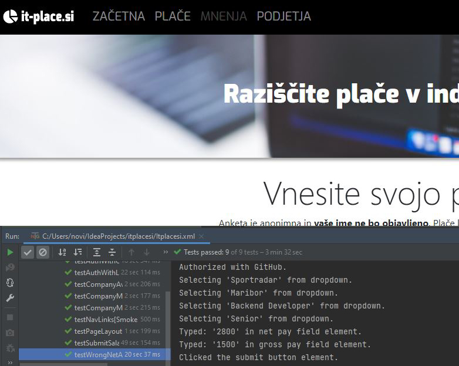

# Selenium WebDriver with Java (it-place.si)
*April 2023*

Here I was developing Java solution for browser automation of my self-built employer review site ([it-place.si](https://it-place.si/)). Framework is built with Page Object Model design pattern. As my site uses OAuth and has options to authorize with GitHub or LinkedIn credentials, these credentials are stored in a JSON file so we use the JSON Parser for getting valid username(s) and password(s). We are verifying whether proper design is displayed, links, if user can authorize, if user can submit his salary, if user cannot submit salary with invalid data (ex. net amount bigger than gross), if displayed maximum-minimum-average salaries are calculated right etc. Various selectors are used (id, by Tag Name, CSS, xpath...) and alerts are being handled. I tried to follow good design practices and to optimize the code as much as possible.

